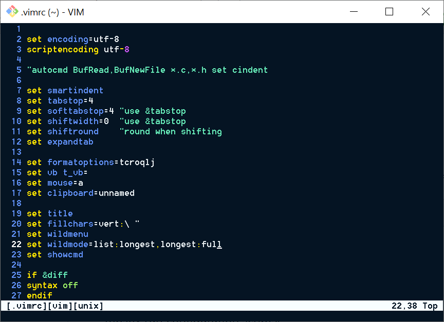
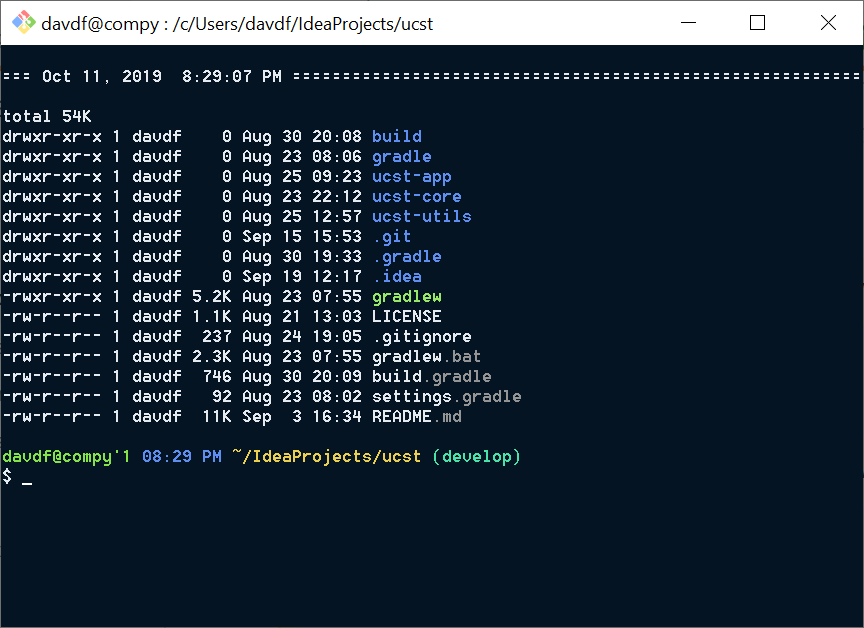

# :womans_hat: Darcy

"darcy" is how I like to relax the pronunciation of `.*rc`- the [fileglob pattern](http://tldp.org/LDP/GNU-Linux-Tools-Summary/html/x11655.htm) for typical standalone [run-configuration](https://wikipedia.org/wiki/Configuration_file) files. Most of the contents of this repo no longer follow that glob pattern ever since I moved everything to fall under one directory, but I decided to keep the name because I like how it sounds.

You will notice that I embed a lot of links in this readme- even ones that you may feel are redundant- and that I don't speak from a very technical point of view. This is mostly because I can only speak to the limits of my knowledge and understanding, but also because I write this in hopes to encourage some of my friends to warm up to the idea of working in a terminal. I want to demonstrate that a terminal can be made more liveable, and to share the steps of the journey I've taken in discovering how to do that.

 

## :briefcase: How to use it
As I said before, everything is under one directory, which means less clutter, and easier portability. All you need to do to mirror my environment is to:
1. Clone and copy the contents of this repo into the directory specified by the environment variable [`XGD_CONFIG_HOME`](https://wiki.archlinux.org/index.php/XDG_Base_Directory), which by convention is usually `~/.config/`, if set by default.
1. Source [`:/bash/bashrc`](git/bashrc) in your `~/.bash_profile` file, or whatever is passed as the `--init-file` argument when invoking bash.
1. You can put a gitconfig-style file in [`:/git/config__local`](git) containing your name and email.
1. Similarly, you can put machine-local bash run-config comands in [`:/bash/aliases__local`](bash).

As an important disclaimer, I can only say for a fact that this works with the standard utilities that ship with [Git for Windows](https://gitforwindows.org/).

 

## :turtle: Why I do this
I like to poke around and explore things. To me, reading about different parts of the terminal environment is like going on a treasure hunt. And while half the time I don't even know what I'm looking for, I enjoy almost every minute of it. At first, the question that always came up in my mind was "why is *<thing that doesn't follow conventions of modern applications>* this way?". And as I explored and learned about different pieces of the bigger picture, I started to see connections and how the pieces build on top of, or around each other.

For example, I wondered why vim doesn't save buffers using ctrl+s by default. As I learned more about vim and started trying to write keymappings, I found out that ctrl+s is reserved for manual [XON/XOFF flow-control](https://wikipedia.org/wiki/Software_flow_control) in most terminals, which exists because before terminals were emulated by modern computers, which can scroll through scrollback buffers quite quickly, people needed a mechanism to pause a terminal's output so the operator could actually read it. Vim, for the most part, being a superset of VI, followed in VI's footsteps to honor the terminal's [default ownership](https://retrocomputing.stackexchange.com/questions/7263/) of that key-sequence. I found that this behaviour could be disabled using the stty (set teletype) command, which allowed me to map the update command in vim to ctrl+s. As an aside, if there are any hardcore vim users shaking their fists right now saying I'm using vim wrong, I disagree. I think that if you leverage the configurability of a tool to make it work better for yourself, you are doing it exactly right.

If you're wondering why I don't use [WSL](https://docs.microsoft.com/windows/wsl), it's because when I started using git-for-windows, I had absolutely no idea what was going on, and it was hard for me to do or find worthwhile pretty much anything I saw. I've come a long way since then, and I may look at switching to WSL in the future, but not until I feel like I'm being limited by MinGW.

 

## :balloon: A Bird's Eye View

This is a high level view of what I have learned about terminal-related facilities. If I had to sum up my approach to learning my way around the terminal environment, it would be to poke around, read command manual pages, and search them up on the internet. I may have accidentally gotten something wrong, so if you notice a mistake or something that can be improved, please shoot me a message or email and correct me!

program                 | description
:----------------------:| -------------------------
:shell: bash         | <b>messenger between you and your computer</b> A shell based on sh with features from other shells like csh and ksh. Shells allow you to interact with your operating system's kernel by providing certain services, and making those callable through a command-line interface (you type words that tell your computer to do things). Those services include creating and destroying files and directories, writing to and reading from files, performing file processing, navigating directories, job / process management, and very importantly, running executable files. Bash (as well as readline) was originally developed by [Brian Fox](https://wikipedia.org/wiki/Brian_Fox_(computer_programmer)), and then passed to [Chet Ramey](https://tiswww.case.edu/php/chet/).  When I started learning about bash (coming from C and Java), the thing that boggled my mind the most was that you could [create and destroy variables on the spot](https://digitalocean.com/community/tutorials/how-to-read-and-set-environmental-and-shell-variables-on-a-linux-vps#setting-shell-and-environmental-variables), and that [spaces and quotes](https://wikipedia.org/wiki/Internal_field_separator) were somehow super important. Here are other pages from helpful resources and sites:<ul><li>[variables and substitution](https://compciv.org/topics/bash/variables-and-substitution/)</li><li>[environment variables](https://gnu.org/software/bash/manual/html_node/Bash-Variables.html)</li><li>[builtin commands](https://tldp.org/LDP/abs/html/internal.html)</li><li>[shell reference manual](https://tldp.org/LDP/abs/html/refcards.html)</li></ul>
:tv: mintty          | <b>displays text generated by everything else</b> A terminal emulator that ships with git-for-windows. A terminal emulator is basically a window that displays text and adheres to standards on interpreting standardized [control-sequences](https://xfree86.org/current/ctlseqs.html) that include basic text-styling and mouse integration. "tty" is short for ["teletype"](https://wikipedia.org/wiki/Teleprinter). The one thing I feel is lacking in mintty is support for window tabbing.  See ["tips on using mintty"](https://github.com/mintty/mintty/wiki/Tips) and [`.minttyrc`](https://mintty.github.io/mintty.1.html).
:train: readline     | <b>helps you write and repeat commands</b> A program that binds command-line-manipulating actions to key-sequences, such as moving the caret to the beginning of the line (ctrl+a), to the end of the line (ctrl+e), deleting a word (ctrl+w), deleting everything before the caret (ctrl+u), and more. Other actions include command-history recall and searching, as well as structured and [composable auto-completion](https://gnu.org/software/bash/manual/html_node/Programmable-Completion.html).  I have gotten so used to readline key-bindings that I sometimes absent-mindedly close browser tabs while trying to delete a word in the search bar, or open the page's html source trying to delete the search line.  Bindings can be set on the spot using the `bind` command, and defaults can be setup in an [`.inputrc`](https://gnu.org/software/bash/manual/html_node/Readline-Init-File.html) file. You can find a full description of default bindings and actions [here](https://gnu.org/software/bash/manual/html_node/Bindable-Readline-Commands.html).
:scroll: less        | <b>use to scroll through lots of text</b> A [terminal pager](https://wikipedia.org/wiki/Terminal_pager). It allows you to feed it input from a file or the output of another command, and then to quickly scroll through that text using mappable key-bindings.  You can view its help page with the command `less --help` (which it will- somewhat cheekily- display to you using itself). To quit the pager, press `q`. User configurations can be specified in a [`.lesskey`](https://linux.die.net/man/1/lesskey) file.
:pencil2: vim        | <b>light and powerful text editor with no gui</b> Vim is a text editor that displays in your terminal window. It has little to no user interface, and leaves all actions to short key-sequences. It is known for having a sharp learning curve (like a wall ([or maybe not](https://thoughtbot.com/blog/the-vim-learning-curve-is-a-myth))), but having that when-your-scissors-start-gliding feeling after you climb over it (or maybe we [never can](https://stackoverflow.com/a/1220118/11107541) completely climb over it and we are just gliding as we climb). Here's a [good read](https://csswizardry.com/2014/06/vim-for-people-who-think-things-like-vim-are-weird-and-hard/) advocating for vim.  I had a lightbulb moment about vim after learning about keybindings in readline and less: in normal mode, vim uses paging key-bindings identical to those in the less pager (usually with the `ctrl` key prepended). That includes ctrl+d, ctrl+u, ctrl+f, ctrl+b, g, G, j, k, ctrl+y, and ctrl+e. It also uses the same mappings to set and jump to (book)marks, and to perform searching (/, n, and N) and file opening (:e). In insert mode, vim follows some movement key-bindings from readline, such as ctrl+w and ctrl+u.  I think the most important command in vim for a beginner is not that to quit vim, but that to open the help menu, which you can do by going to normal mode (ctrl+c), and then typing `:help`, optionally followed by a search topic. Also see the [vim cheatsheet](https://www.fprintf.net/vimCheatSheet.html), and [tips on vim](https://moolenaar.net/habits.html) written by the person who wrote it, [Bram Moolenaar](https://wikipedia.org/wiki/Bram_Moolenaar).
:camera: git         | <b>google drive but for code projects</b> A version control system that saves incremental changes as snapshots of changed files in their entirety in a local hidden directory as a tree-like structure. Made to allow you to save incremental changes to your project, and work collaboratively using operations to sync up changes made by you and possible partners. One of the nicest things about git is that you can make commits without an internet connection.  I have found git's tutorial-style documentation on [branching](https://git-scm.com/book/en/v2/Git-Branching-Branches-in-a-Nutshell) and on [demystifying the reset command](https://git-scm.com/book/en/v2/Git-Tools-Reset-Demystified) to be incredibly helpful.

 
 

## How it looks when I start bash:

 

## How my vim looks:

 

## My modified "ls -la":

